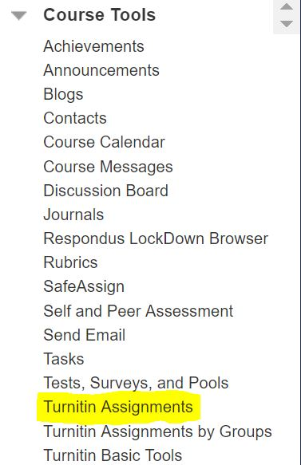
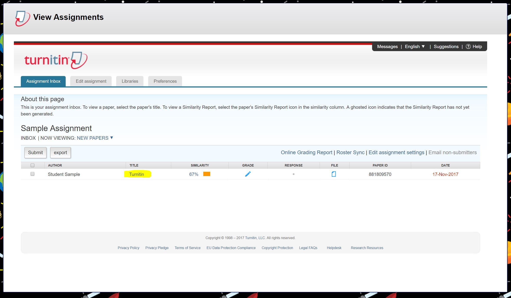
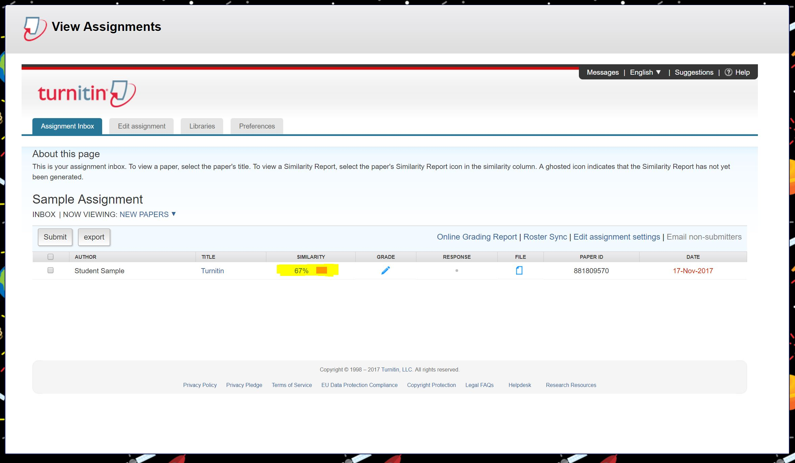

# Viewing Assignment and Similarity Report

​Instructors can view the student's Turnitin submission through the Control Panel and the Turnitin Assignments tool.

1. Access the **Control Panel​** -&gt; **Course Tools**
2. Select 

   **Turnitin Assignments**

   . 

   

3. Click on the 

   **title​**

    for the Turnitin assignment. 

   

4. Click on the percentage figure located under the "

   **Similarity**

   ​" column to view the originality report of the student report. 

   

